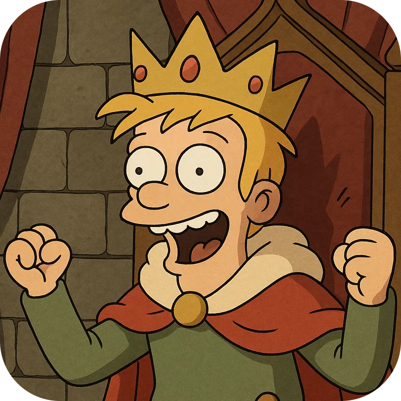
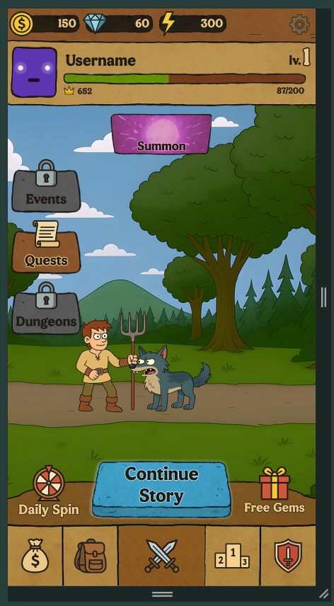
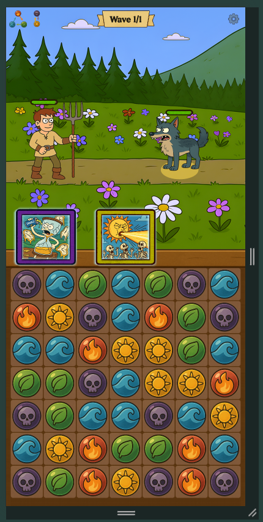
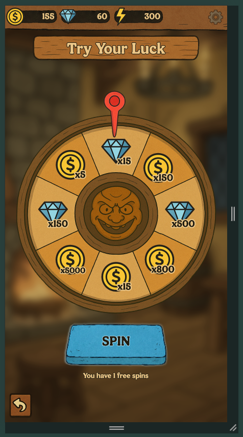
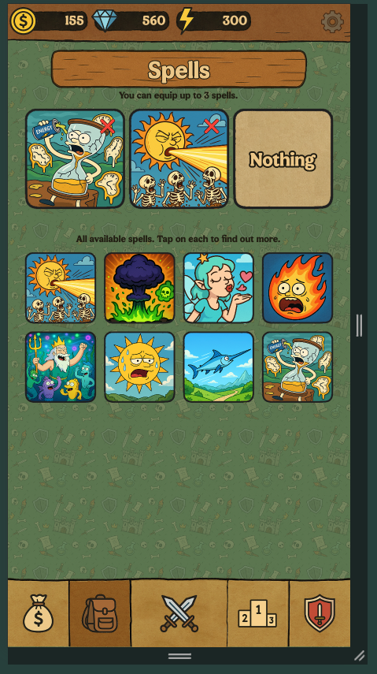

<h1>
Демо-игра "HOLY GLORY"
</h1>

Игра разрабатывалась летом 2025 года как проверка собственных способностей.

<h2>Механики и особенности гейм-дизайна</h2>
- Match 3 + автобатлер. Игроку необходимо пробираться через орды монстров, собирая комбо из рун разных типов.
- 10 особых способностей персонажа 
- Система квестов
- Daily spin
- Антистресс-кликер (на главном экране можно тапать по волку)

<h2>Как это реализовано технически</h2>
- Node-based (a.k.a. Scene Tree) архитектура на PixiJS (./lib/BaseNode)
- Реактивное обновление данных
- setTimeout и Tween привязанные к requestAnimationFrame
- Рабочее меню из 7 экранов и UI-kit
- Покадровые анимации, спайны
- Автозагрузка ассетов с помощью vite virtual плагинов
- Particle-emitters
- Ресайзер экрана (только для вертикальных устройств)
- Все ассеты сгенерированы с помощью Sora

<h2>Скриншоты</h2>

